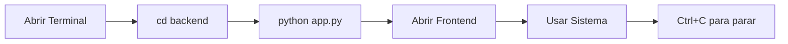

# 🚀 Guía Rápida - Cómo Ejecutar el Sistema

Esta guía asume que ya tienes el proyecto descargado y las dependencias instaladas. Si es tu primera vez, consulta [iniciar.md](./iniciar.md) para la instalación completa.

---

## ⚡ Inicio Rápido (30 segundos)

### Opción 1: Script Automático (Recomendado)

```powershell
# Desde el directorio raíz del proyecto
.\iniciar.ps1
```

💡 **Si hay error de permisos:**
```powershell
Set-ExecutionPolicy -ExecutionPolicy Bypass -Scope Process -Force
.\iniciar.ps1
```

### Opción 2: Manual en 3 Pasos

```powershell
# 1. Ir al directorio backend
cd backend

# 2. Ejecutar el servidor
python app.py

# 3. Abrir frontend en navegador
start ..\frontend\index.html
```

---

## 📋 Estados del Sistema

### ✅ Sistema Funcionando Correctamente

Cuando veas este mensaje, todo está listo:

```
🏢 Iniciando servidor de Administración de Edificio...
📍 API disponible en: http://localhost:5000
📊 Endpoints disponibles:
   - GET/POST/PUT/DELETE /api/departamentos
   - GET/POST/PUT/DELETE /api/inquilinos
   - GET/POST/PUT/DELETE /api/empleados
   - GET/POST/PUT/DELETE /api/pagos
   - GET /api/health
 * Running on http://127.0.0.1:5000
 * Running on http://192.168.0.4:5000
```

### 🌐 Acceso a la Aplicación

Una vez que el servidor esté ejecutándose:

1. **Backend API**: http://localhost:5000
2. **Frontend Web**: Abrir `frontend/index.html` en navegador
3. **Verificación**: http://localhost:5000/api/health

---

## 🔄 Comandos Útiles Durante Ejecución

### Verificar Estado del Sistema

```powershell
# Probar que la API responde
curl http://localhost:5000/api/health

# Verificar departamentos (ejemplo)
curl http://localhost:5000/api/departamentos
```

### Detener el Sistema

```powershell
# En la terminal donde corre el servidor
Ctrl + C
```

### Reiniciar el Sistema

```powershell
# Detener (Ctrl+C) y luego:
python app.py
```

---

## 🎯 Diferentes Formas de Ejecutar

### 1. Con Entorno Virtual Activado

```powershell
# Si ya tienes el entorno virtual creado
.\.venv\Scripts\Activate.ps1
cd backend
python app.py
```

### 2. Sin Entorno Virtual

```powershell
# Directamente con Python del sistema
cd backend
python app.py
```

### 3. Con Ruta Específica de Python

```powershell
# Si VS Code configuró un entorno específico
cd backend
c:/Users/[TuUsuario]/Desktop/proyecto2025/.venv/Scripts/python.exe app.py
```

### 4. En Background (Segundo Plano)

```powershell
# Para ejecutar en segundo plano
cd backend
Start-Process python -ArgumentList "app.py" -WindowStyle Hidden
```

---

## 📱 Acceso Desde Otros Dispositivos

### En la Misma Red Local

El servidor está configurado para aceptar conexiones desde cualquier IP:

```
Backend: http://[IP-DE-TU-PC]:5000
Frontend: Copiar carpeta frontend al dispositivo
```

Para encontrar tu IP:
```powershell
ipconfig | findstr IPv4
```

### Ejemplo de Uso Móvil

1. **Encuentra tu IP**: `192.168.1.100` (ejemplo)
2. **Backend funciona en**: `http://192.168.1.100:5000`
3. **Frontend**: Copia `frontend/` al dispositivo móvil y abre `index.html`

---

## 🛠 Solución Rápida de Problemas

### ❌ Error: Puerto ocupado

```powershell
# Terminar proceso en puerto 5000
netstat -ano | findstr 5000
taskkill /PID [numero_del_proceso] /F

# O cambiar puerto en app.py (línea final):
# app.run(host='0.0.0.0', port=5001, debug=True)
```

### ❌ Error: Python no encontrado

```powershell
# Verificar Python
python --version
py --version

# Si no funciona, usar ruta completa:
C:\Python312\python.exe app.py
```

### ❌ Error: Módulo no encontrado

```powershell
# Reinstalar dependencias
pip install Flask Flask-CORS
```

### ❌ Frontend no carga datos

1. ✅ Verificar que backend esté ejecutándose
2. ✅ Abrir `http://localhost:5000/api/health`
3. ✅ Verificar consola del navegador (F12)

---

## 📊 Monitoreo del Sistema

### Ver Logs en Tiempo Real

El servidor muestra automáticamente:
- ✅ Requests HTTP entrantes
- ✅ Errores de la aplicación
- ✅ Estado de conexiones a la base de datos

### Verificar Base de Datos

```powershell
# La base de datos se crea automáticamente en:
# backend/edificio.db

# Para ver el contenido (opcional):
cd backend
python
>>> from database import Database
>>> db = Database()
>>> # ... consultas SQL
```

---

## 🎯 Funcionalidades Disponibles

Una vez que el sistema esté corriendo, puedes:

### 🏠 Gestión de Departamentos
- ➕ Crear nuevos departamentos
- 📝 Editar información (número, piso, estado)
- 🗑 Eliminar departamentos
- 👀 Ver lista completa

### 👥 Gestión de Inquilinos
- ➕ Registrar nuevos inquilinos
- 📝 Actualizar datos de contacto
- 🏠 Asignar a departamentos
- 🗑 Dar de baja inquilinos

### 👷 Gestión de Empleados
- ➕ Contratar personal
- 📝 Actualizar roles y horarios
- 📞 Mantener datos de contacto
- 🗑 Gestionar bajas

### 💰 Gestión de Pagos
- ➕ Registrar pagos recibidos
- 📅 Control por fechas
- 💵 Diferentes conceptos (alquiler, expensas, etc.)
- 📊 Historial de pagos

---

## 🔄 Flujo de Trabajo Típico



### Ejemplo de Sesión Completa

```powershell
# 1. Navegar al proyecto
cd "C:\Users\[TuUsuario]\Desktop\proyecto2025"

# 2. Ejecutar sistema
.\iniciar.ps1

# 3. Sistema corriendo... trabajar normalmente

# 4. Al terminar
# Presionar Ctrl+C en la terminal
```

---

## 📝 Notas Importantes

### ⚠️ Antes de Ejecutar
- ✅ Verificar que el puerto 5000 esté libre
- ✅ Confirmar que Python esté instalado
- ✅ Asegurarse de estar en el directorio correcto

### 💡 Consejos de Uso
- 🔄 El servidor se reinicia automáticamente al detectar cambios en el código
- 💾 Los datos se guardan automáticamente en `edificio.db`
- 🌐 Puedes acceder desde múltiples navegadores simultáneamente
- 📱 Funciona en dispositivos móviles en la misma red

### 🔒 Seguridad
- ⚠️ Este es un servidor de desarrollo, no usar en producción
- 🏠 Solo accesible en red local por defecto
- 🔐 No hay autenticación implementada (para desarrollo)

---

## 🆘 Soporte Rápido

### Si algo no funciona:

1. **Revisar terminal** - ¿Hay mensajes de error?
2. **Verificar puerto** - ¿Está libre el 5000?
3. **Probar API** - ¿Responde `http://localhost:5000/api/health`?
4. **Reiniciar** - Ctrl+C y volver a ejecutar
5. **Consultar logs** - ¿Qué dice la consola del navegador?

### Comandos de Diagnóstico

```powershell
# Verificar que todo esté bien
python --version          # ¿Python instalado?
pip list | findstr Flask  # ¿Flask instalado?
netstat -an | findstr 5000  # ¿Puerto libre?
curl http://localhost:5000/api/health  # ¿API responde?
```

---

**¡Listo para usar! 🎉**

El sistema debería estar funcionando perfectamente. Si tienes problemas, consulta la documentación completa en [iniciar.md](./iniciar.md) o revisa la sección de solución de problemas.

---

*Guía de ejecución - Sistema de Administración de Edificio*  
*Actualizada: 11 de septiembre de 2025*
